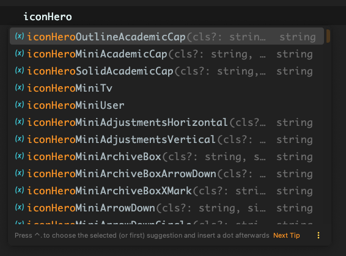

# @marianmeres/icons-fns

Icon svgs from various providers wrapped as functions (with props argument)
returning the icon svg string. Each icon function lives in a separate file and is typed.

All credit (and copyright) belongs to these icon providers:

- [Bootstrap icons](https://icons.getbootstrap.com/)
- [Boxicons](https://boxicons.com/)
- [Bytesize icons](https://danklammer.com/bytesize-icons/)
- [Feather icons](https://feathericons.com/)
- [Font Awesome Icons (Free)](https://fontawesome.com/icons)
- [Heroicons](https://heroicons.com/)

Thanks for the amazing work.

## Install

```shell
npm i @marianmeres/icons-fns
```

## Usage

Each icon function is prefixed with the vendor name (and icon type where applicable):

- Bootstrap: `iconBs`
- Boxicons: `iconBx`
- Bytesize: `iconBytesizeRegular`, `iconBytesizeSolid`
- Feather: `iconFeather`
- Font Awesome Icons (Free): `iconFaRegular`, `iconFaSolid`
- Heroicons: `iconHeroMini`, `iconHeroOutline`, `iconHeroSolid`

Signature for all functions is:

```typescript
iconPrefixIconName(props?: Partial<{
    size: number;
    class: string;
    style: string;
    // stroke-width is supported only for "Feather" and "Bytesize"
    strokeWidth: number;
}>): string;

// for backward compatibility, the v1 signature is also supported
// but should be considered as deprecated
iconPrefixIconName(cls?: string, size?: number, style?: string): string;
```

so the actual usage example may look like:

```javascript
import { iconHeroMiniAcademicCap } from '@marianmeres/icons-fns';

const svg = iconHeroMiniAcademicCap({
	class: 'inline-block',
	size: 32,
	style: 'color: blue;',
});

// svg now contains:
// <svg class='inline-block' width="32" height="32" style="color: blue;" ... >...</svg>
```

All functions are typed, so your IDE should be able to typehint:



## Related

- https://github.com/marianmeres/emoji-fns
