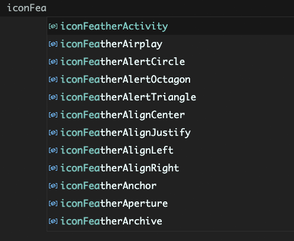

# @marianmeres/icons-fns

[Bootstrap icons](https://icons.getbootstrap.com/) and [Heroicons](https://heroicons.com/) 
icon svgs wrapped as ES6 functions with customization arguments returning svg tag string. 
Each icon function lives in a separate file and is typed.

It's worth emphasizing, that all copyright and credit belongs to:
- [Bootstrap icons](https://icons.getbootstrap.com/)
- [Heroicons](https://heroicons.com/)

Thanks again for the amazing work.

## Install
```shell
npm i @marianmeres/icons-fns
```

## Usage

[Bootstrap icons](https://icons.getbootstrap.com/) are prefixed with `iconBs`, 
[Heroicons](https://heroicons.com/) with `iconHeroMini`, `iconHeroOutline`
and `iconHeroSolid`.

Signature for all functions is:

```typescript
iconPrefixIconName(cls?: string, size?: number, style?: string): string;
```

so the actual usage example may look like:

```javascript
import { iconHeroMiniAcademicCap } from "@marianmeres/icons-fns";

// all arguments are optional and size defaults to original (bootstrap 16, heroicons 24, 
// heroicons mini 20)
const svg = iconHeroMiniAcademicCap('inline-block', 32, 'color: blue;');

// svg now contains:
// <svg class='inline-block' size="32" style="color: blue;" ... >...</svg>
```

All functions are typed, so your IDE should be able to typehint:


